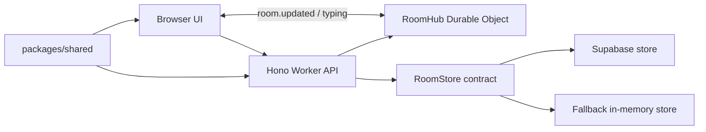

# Architecture

Turntabl Score Room is a compact monorepo: one UI, one Worker API, and one shared domain package that keeps match-room rules from drifting.

## Workspace Map

```text
apps/web         Vue 3, Vite, Tailwind CSS UI
apps/api         Cloudflare Worker API, Hono, Durable Object room hub
packages/shared  Types, fixtures, validation, room state, insights
supabase         SQL migrations for persistent storage
docs             Human-friendly project guides
tasks            Earlier task briefs and implementation notes
```

## Runtime Flow



## Boundaries

`packages/shared` owns:

- fixture loading and kickoff lookup
- room locked/open state
- cycle grouping and room slate selection
- prediction insight/readout math
- identity and pickup validation
- shared API and room types

`apps/api` owns:

- REST request parsing and validation
- mutation orchestration
- Supabase persistence
- fallback in-memory store
- Durable Object broadcast wiring
- live score and room sync scripts

`apps/web` owns:

- room switching and prediction UI
- readout carousel presentation
- local identity and pickup setup
- optimistic cache transforms
- reply/thread view models
- lazy admin prize desk UI

## Persistence Model

Supabase stores rooms, predictions, likes, comments, replies, score state, visibility state, and prize pickup claims. The API keeps schema fallbacks in a few query paths so older local databases can still boot while migrations are being applied.

When Supabase config is missing, `apps/api/src/store.ts` provides an in-memory store. That path is useful for local work, not durable production data.

## Realtime Model

Mutations return the updated room and broadcast `room.updated`. Typing events go through the room hub and are short-lived UI signals.

On Workers, broadcasts use the `RoomHub` Durable Object. Locally without that binding, the fallback store broadcasts to in-process clients.

## Performance Notes

- API room hydration has a short TTL cache for rapid follow-up reads.
- Supabase graph loads batch nested data to avoid one-query-per-row behavior.
- The admin prize desk is async-loaded, keeping normal room visitors away from admin-only UI code.
- The prediction feed renders progressively for busy rooms.
